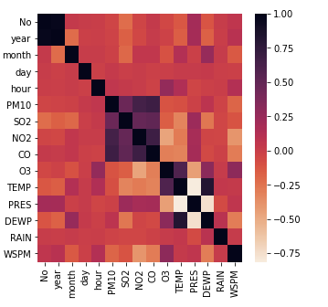
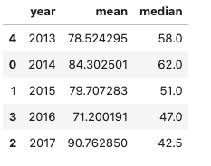
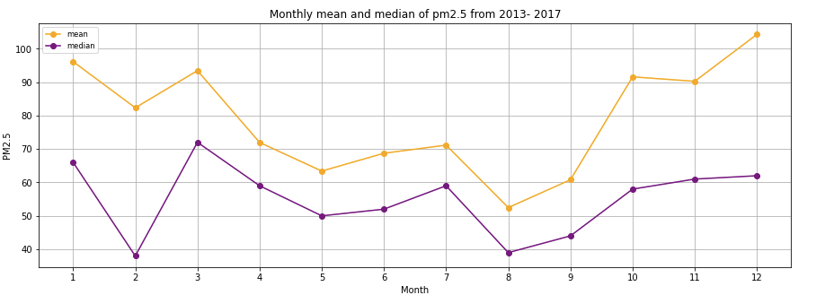
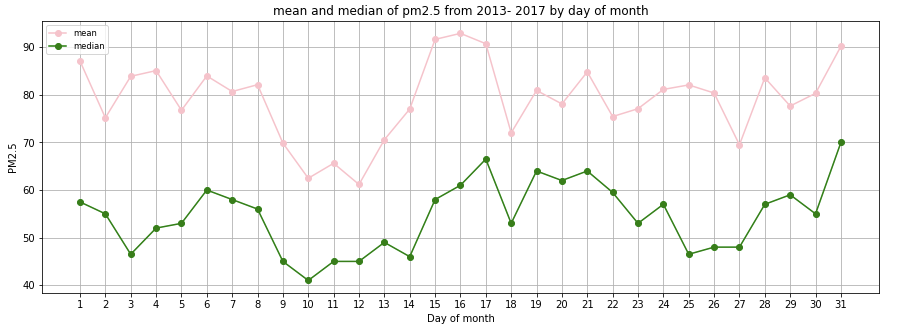
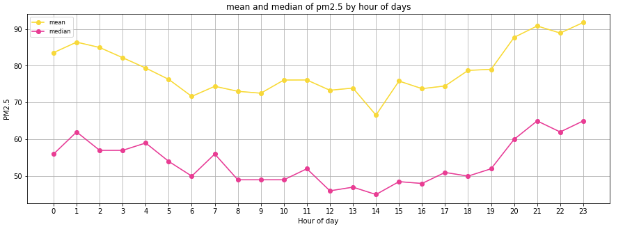
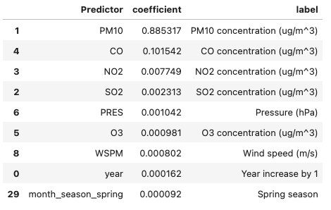
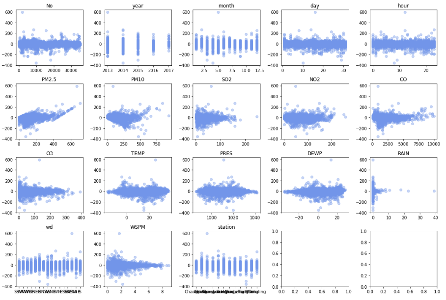

# Predicting Particulate Matter of 2.5 Microns or Less in Diameter (PM 2.5)

## The Beijing Multi-Site Air-Quality Data

# Background and importance 

PM2.5 is a widespread and inhalable air pollutant with serious health implications, making accurate data on its concentration essential for informing policies aimed at reducing pollution. In developed countries, most urban areas have multiple PM2.5 monitors, with an estimated one monitor per 100,000 to 600,000 residents in Europe and North America (World Health Organization, 2018). However, in less developed regions, air quality monitoring is severely lacking; for instance, sub-Saharan Africa has only one monitor per 15.9 million residents (WHO Global Ambient Air Quality Database, 2016). Given these disparities, my goal focuses on developing a model that leverages available PM2.5 data to predict pollution levels in areas with little to no monitoring.

# Task

My task is a regression task predicting outdoor PM.2.5 (ug/m^3) using the Beijing Multi-site air quality data. The original dataset has 420768 hourly observations over 5 years (2013-17) across 12 air-quality monitoring sites in Beijing, China. The dataframe stores 420768 observation of air quality across 12 sites, each site has data over 5 years with 35064 observation in each year. 

**Disclosure**

Given the large sample size of the data and my computer power, I was not able to perform many model training techniques. For instance, I performed GridSearchCV and RandomSearchCV with 3-folds cross-validation and a few combinations of parameters; I was not able to run it within a reasonable time. So, I decided to add this step in data preprocessing to randomly select a subset of the full dataset, although this might not be the best solution in practice.

[Download the data](https://archive.ics.uci.edu/ml/datasets/Beijing+Multi-Site+Air-Quality+Data)

# Method 

**Attribute information**

- No: row number of observation in each site
- year: year of data in this row
- month: month of data in this row
- day: day of data in this row
- hour: hour of data in this row
- PM2.5: PM2.5 concentration (ug/m^3)
- PM10: PM10 concentration (ug/m^3)
- SO2: SO2 concentration (ug/m^3)
- NO2: NO2 concentration (ug/m^3)
- CO: CO concentration (ug/m^3)
- O3: O3 concentration (ug/m^3)
- TEMP: temperature (degree Celsius)
- PRES: pressure (hPa)
- DEWP: dew point temperature (degree Celsius)
- RAIN: precipitation (mm)
- wd: wind direction
- WSPM: wind speed (m/s)
- station: name of the air-quality monitoring site

The correlation matrix shows that TEMP, PRES, and DEWP are highly correlated with each other (which makes sense). This would cause multicollinearity issues if I fit them all in, for example, a linear regression model. So, I may consider to only keep TEMP.




**Model training & evaluation**

I apply several methods, including simple linear regression model, Lasso regression, support vector regression, decision tree regression, and randomforest regression. General models selection steps are as follow:
- Hyper-parameter tuning: apply GridSearch and a 3-5-folds cross validation in the training set to select the best model
- Evaluate the best model performance in the test set that was set aside
- Error analysis for the final best model

# Results and interpretation

**Overall trend** 

PM 2.5 vary by time. The general trend of PM2.5 from 2.13-17 is descreading, but this has to take into consideration the fact that there were a lot fewer observations in the year 2017.



Distribution of PM2.5 by year from 2013-2017. The increase in mean of 2017 was driven by a larger proportions of measurements in the higher range and much less total number of observations compared to other years. The median shows that the the level of PM2.5 in 2017 is lower than other years. But this might be related to the fact that there were much fewer observations for 2017 in the original data.

Within a year, PM2.5 level is averagely higher among the winter months (November- March) compared to the rest of the year.



Within a month, there are lower average levels of PM 2.5 clustered around the 9th to the 13th days of the month.



Within a day, PM2.5 tends to peak from evening to midnight. (8pm to 3am the next day)



These univariate relationship between time and PM2.5 have important implications for me in terms of how to include these features in my analysis. 
- Month, day, hour: The lack of linearity of these features and PM2.5 suggests that it is better to one-hot code them instead of treat them as a numeric value. But one-hot coding all these time features would lead to a large number of features that are not that informative for interpretation and not useful for making prediction. So, I converted these features into categories such as winter, spring, summer, winter, morning, evening, etc.
- Year: Given that the median of PM2.5 decrease over the year somewhat linearily and it is more useful to include year as a numeric feature for interpretation and prediction purposes. For example, it makes sense to look at year and say one year increase in time in the future would lead to certain change in PM2.5. This would not be true if treating year as some binary features (e.g., 2017 vs. not 2017).

**Final model** 

The decision tree regressor model produced the best and most concise model. The model achieved an R^2 of 0.85 with 9 features. Many of the air pollution measures other than PM2.5 are predictive of PM2.5, which could be useful to make prediction when these information are available. Spring season, year, and wind speed were also positively associated with increase level of PM2.5.



Residual plots help identify where a model's predictions deviate from actual values. In a well-performing model, residuals should be randomly scattered around the y=0 line, indicating no systematic bias and homoscedasticity. Plotting residuals against each feature provides valuable insights. In this case, residuals are not randomly distributed against PM2.5, suggesting that important predictors may be missing from the model. Additionally, larger residuals tend to occur when precipitation and wind speed are low, indicating potential relationships that the model has not fully captured.



## View the full report

- [View the full script (Data Preprocessing & Analysis)](script/full_script.ipynb)

## Project organization

```
.
├── data/                              : contains downloaded data
├── plots/                             : contains images 
├── presentation/                      : contains a recorded presentation based on the project 
├── script/                            : contains a full script 

```


